<h1 align="center">
  🌐 KONGALI FOUNDATION</h1>
</p>

---
<p align="center">
  https://github.com/kongali1720/Kong-Community
</p>

<h1 align="center">🦍 Kong Community</h1>

<p align="center">
  Ekosistem digital terintegrasi berbasis komunitas: Chat, Wallet, Bank, Payment, Network, Teknologi, Swift & AI Masa Depan.
</p>

<p align="center">
  <a href="LICENSE"></a>
  
  
  
</p>

<p align="center">
  
</p>

---

## 🔥 Tentang Proyek

<p align="center">
<strong>Kong Community</strong> adalah ekosistem open-source digital yang menyatukan berbagai layanan dan teknologi dalam satu komunitas besar yang saling terhubung, mencakup komunikasi, keuangan, jaringan, dan AI masa depan.
</p>

---

## 🧩 Modul & Sub-Proyek

<p align="center">

# 🌐 Ekosistem KONG - Tabel Modul, Badge & Deskripsi

| Modul | Badge | Deskripsi |
|-------|-------|-----------|
| KongSERVER |  | Infrastruktur server & cloud computing untuk semua modul Kong. Backbone ekosistem. |
| KongNET |  | Infrastruktur jaringan, DNS, dan keamanan komunitas. Layer keamanan jaringan. |
| KongCHAT |  | Platform komunikasi realtime & terenkripsi. Mendukung kolaborasi antar modul. |
| KongaWALLET |  | Dompet multi-chain untuk manajemen aset digital. Integrasi dengan trading & payment. |
| KongBANK |  | Sistem perbankan digital (rekening, transaksi, laporan). Edukasi finansial. |
| KongPAY |  | Payment gateway untuk Visa, PayPal, dan metode pembayaran lain. Terintegrasi dengan KongBANK. |
| KongSWIFT |  | Sistem pembayaran SWIFT MT103. |
| KongCRYPTO-TRADING |  | Platform trading otomatis untuk cryptocurrency & analisis pasar. Terintegrasi dengan KongaWALLET. |
| KongTECH |  | Riset & pengembangan teknologi baru (IoT, Web3, AI). Lab inovasi modul Kong. |
| YouNEXT |  | Proyek lanjutan berbasis AI, Web3, dan teknologi masa depan. Fokus eksperimen inovatif. |

</p>

---

## 📁 Struktur Repositori

```bash
KONG-Ecosystem/
│
├── README.md                   # Overview utama ekosistem KONG
├── LICENSE                     # Lisensi proyek
├── docs/                       # Dokumentasi umum
│   └── overview.md
│
├── infrastructure/             # Modul Infrastruktur & Jaringan
│   ├── KongSERVER/
│   │   ├── README.md
│   │   └── config/             # Konfigurasi server & cloud
│   └── KongNET/
│       ├── README.md
│       └── config/             # Konfigurasi jaringan, DNS, firewall
│
├── communication/              # Modul Komunikasi & Keamanan
│   └── KongCHAT/
│       ├── README.md
│       └── src/                # Source code / service chat
│
├── financial/                  # Modul Finansial & Pembayaran
│   ├── KongaWALLET/
│   │   ├── README.md
│   │   └── src/                # Wallet multi-chain
│   ├── KongBANK/
│   │   ├── README.md
│   │   └── src/                # Perbankan digital
│   ├── KongPAY/
│   │   ├── README.md
│   │   └── src/                # Payment gateway
│   ├── KongSWIFT/
│   │   ├── README.md
│   │   └── src/                # SWIFT MT103 integration
│   └── KongCRYPTO-TRADING/
│       ├── README.md
│       └── src/                # Trading bot & market analysis
│
└── research/                   # Modul Research & Development
    ├── KongTECH/
    │   ├── README.md
    │   └── projects/           # Riset IoT, Web3, AI
    └── YouNEXT/
        ├── README.md
        └── projects/           # Proyek AI & teknologi masa depan
```

flowchart TD
    User([🧑 KONGALI1720 (User)]) --> KongCommunity[[🦍 Kong Community]]

```mermaid
flowchart TD
    %% Node User & Community
    User["KONGALI1720 🧑"] --> KongCommunity["Kong Community 🦍"]

    %% Infrastruktur & Jaringan
    KongCommunity --> Server["KongSERVER 🖥️"]
    KongCommunity --> Net["KongNET ⚙️"]

    %% Komunikasi & Keamanan
    KongCommunity --> Chat["KongCHAT 🟢"]

    %% Finansial & Pembayaran
    KongCommunity --> Wallet["KongaWALLET 🟡"]
    KongCommunity --> Bank["KongBANK 🔵"]
    KongCommunity --> Pay["KongPAY 🟠"]
    KongCommunity --> Swift["KongSWIFT 💸"]
    KongCommunity --> Crypto["KongCRYPTO-TRADING 💰"]

    %% Research & Development
    KongCommunity --> Tech["KongTECH 🧪"]
    KongCommunity --> Next["YouNEXT 🤖"]

    %% Minimal connections
    Wallet --> Crypto
    Bank --> Pay
    Chat --> Net
    Tech --> Next

    %% Styling colors
    style KongCommunity fill:#1f1f1f,stroke:#00ff88,stroke-width:2px,color:white
    style Server fill:#34495e,color:white
    style Net fill:#7f8c8d,color:white
    style Chat fill:#27ae60,color:white
    style Wallet fill:#f1c40f,color:black
    style Bank fill:#3498db,color:white
    style Pay fill:#e67e22,color:white
    style Swift fill:#c0392b,color:white
    style Crypto fill:#d35400,color:white
    style Tech fill:#8e44ad,color:white
    style Next fill:#16a085,color:white
```



🎯 Tujuan Proyek
Membangun komunitas digital terdesentralisasi

Mengedukasi publik soal teknologi modern (Crypto, AI, Jaringan, Keuangan)

Menciptakan platform kolaboratif terbuka & transparan

Menyediakan layanan simulatif yang realistis & aman

🤝 Kontribusi
Kami membuka peluang kontribusi! Fork repositori ini, buat branch, dan ajukan Pull Request.

📜 Lisensi
Proyek ini menggunakan lisensi MIT.

---


## ✅ Gaspol coding squad Indonesia! 🚀💻

> Belajar sambil praktek langsung. Run it, understand it.  
> Mini project Python yang gak bikin ngantuk!

---

## ☕ Traktir Kopi & Nasi Padang

<p align="center">
  <strong>Dukung terus biar semangat bikin karya edukatif lainnya...</strong><br>
  💡 ☕ <a href="https://www.paypal.com/paypalme/bungtempong99" target="_blank">Buy Me a Coffee via PayPal</a>
</p>

---

## ❤️ INITIATING HUMANITY MODE... for Down Syndrome

| Target        | Anak-anak Pejuang Down Syndrome |
|---------------|-------------------------------|
| Status        | Butuh Dukungan                |
| Aksi          | Buka Hati + Klik Link = Senyum Baru |

> Mereka bukan berbeda. Mereka hadir untuk mengajarkan kita arti cinta sejati dan kesabaran.

<p align="center">
  <a href="https://mydonation4ds.github.io/" target="_blank">
    
  </a>
</p>

---

## 💳 Dukungan Pembayaran DONASI

<p align="center">
  
  &nbsp;&nbsp;
  
  &nbsp;&nbsp;
  
</p>

---

<p align="center">
  Kalau project ini bermanfaat, kasih ⭐ ya dan share ke temen-temenmu!<br>
  Follow <a href="https://twitter.com/kongali1720" target="_blank">@kongali1720</a> buat update seru lainnya 🔥
</p>

<p align="center">
  <a href="https://twitter.com/kongali1720" target="_blank">
    
  </a>
</p>


