<p align="center">
  https://github.com/kongali1720/Kong-Community
</p>

<h1 align="center">🦍 Kong Community</h1>

<p align="center">
  Ekosistem digital terintegrasi berbasis komunitas: Chat, Wallet, Bank, Payment, Network, Teknologi, Swift & AI Masa Depan.
</p>

<p align="center">
  <a href="LICENSE"></a>
  
  
  
</p>

<p align="center">
  
</p>

---

## 🔥 Tentang Proyek

<p align="center">
<strong>Kong Community</strong> adalah ekosistem open-source digital yang menyatukan berbagai layanan dan teknologi dalam satu komunitas besar yang saling terhubung, mencakup komunikasi, keuangan, jaringan, dan AI masa depan.
</p>

---

## 🧩 Modul & Sub-Proyek

<p align="center">

| Modul        | Badge                                                                 | Deskripsi                                                       |
|--------------|-----------------------------------------------------------------------|-----------------------------------------------------------------|
| **KongCHAT** |        | Platform komunikasi realtime & terenkripsi.                     |
| **KongaWALLET** |  | Dompet multi-chain untuk manajemen aset digital.                |
| **KongBANK** |   | Simulasi sistem perbankan digital (rekening, transaksi, laporan). |
| **KongNET**  |  | Infrastruktur jaringan, DNS, dan jaringan aman komunitas.       |
| **KongPAY**  |         | Payment gateway untuk Visa, PayPal, dan metode pembayaran lain. |
| **KongTECH** |  | Riset & pengembangan teknologi baru (IoT, Web3, dll).           |
| **KongSWIFT**|       | Modul simulasi dan edukasi sistem pembayaran SWIFT MT103.       |
| **YouNEXT**  |  | Proyek lanjutan berbasis AI, Web3, dan teknologi masa depan.    |

</p>

---

## 📁 Struktur Repositori

```bash
Kong-Community/
│
├── kongchat/         # Modul komunikasi (Websocket / Realtime)
├── kongawallet/      # Wallet crypto (mnemonic, private key, balance, tx)
├── kongbank/         # Simulasi rekening dan sistem bank
├── kongnet/          # Sistem jaringan & DNS komunitas
├── kongpay/          # Payment gateway service
├── kongtech/         # Teknologi inovatif & eksperimen
├── kongswift/        # Sistem SWIFT simulatif MT103
└── younex/           # AI, model LLM, crypto-future tech
```

flowchart TD
    User([🧑 YOU (User)]) --> KongCommunity[[🦍 Kong Community]]

```mermaid
flowchart TD
    KongCommunity --> Chat[KongCHAT 🟢]
    KongCommunity --> Wallet[KongaWALLET 🟡]
    KongCommunity --> Bank[KongBANK 🔵]
    KongCommunity --> Pay[KongPAY 🟠]

    Chat --> Net[KongNET ⚙️]
    Wallet --> Net
    Bank --> Net
    Pay --> Net

    Net --> Tech[KongTECH 🧪]
    Net --> Swift[KongSWIFT 💸]
    Net --> Next[YouNEXT 🤖]

    style KongCommunity fill:#1f1f1f,stroke:#00ff88,stroke-width:2px,color:white
    style Chat fill:#27ae60,color:white
    style Wallet fill:#f1c40f,color:black
    style Bank fill:#3498db,color:white
    style Pay fill:#e67e22,color:white
    style Net fill:#7f8c8d,color:white
    style Tech fill:#8e44ad,color:white
    style Swift fill:#c0392b,color:white
    style Next fill:#16a085,color:white
```



🎯 Tujuan Proyek
Membangun komunitas digital terdesentralisasi

Mengedukasi publik soal teknologi modern (Crypto, AI, Jaringan, Keuangan)

Menciptakan platform kolaboratif terbuka & transparan

Menyediakan layanan simulatif yang realistis & aman

🤝 Kontribusi
Kami membuka peluang kontribusi! Fork repositori ini, buat branch, dan ajukan Pull Request.

📜 Lisensi
Proyek ini menggunakan lisensi MIT.

---


## ✅ Gaspol coding squad Indonesia! 🚀💻

> Belajar sambil praktek langsung. Run it, understand it.  
> Mini project Python yang gak bikin ngantuk!

---

## ☕ Traktir Kopi & Nasi Padang

<p align="center">
  <strong>Dukung terus biar semangat bikin karya edukatif lainnya...</strong><br>
  💡 ☕ <a href="https://www.paypal.com/paypalme/bungtempong99" target="_blank">Buy Me a Coffee via PayPal</a>
</p>

---

## 📫 Let’s Connect Like Hackers

| Platform | Detail |
|:--------|:-------|
| GitHub  | [kongali1720](https://github.com/kongali1720) |
| Email   | [kongali1720@gmail.com](mailto:kongali1720@gmail.com) |
| Website | [Coming soon — stay curious...](https://kongali1720.github.io) |

---

## ❤️ INITIATING HUMANITY MODE... for Down Syndrome

| Target        | Anak-anak Pejuang Down Syndrome |
|---------------|-------------------------------|
| Status        | Butuh Dukungan                |
| Aksi          | Buka Hati + Klik Link = Senyum Baru |

> Mereka bukan berbeda. Mereka hadir untuk mengajarkan kita arti cinta sejati dan kesabaran.

<p align="center">
  <a href="https://mydonation4ds.github.io/" target="_blank">
    
  </a>
</p>

---

## 💳 Dukungan Pembayaran DONASI

<p align="center">
  
  &nbsp;&nbsp;
  
  &nbsp;&nbsp;
  
</p>

---

<p align="center">
  Kalau project ini bermanfaat, kasih ⭐ ya dan share ke temen-temenmu!<br>
  Follow <a href="https://twitter.com/kongali1720" target="_blank">@kongali1720</a> buat update seru lainnya 🔥
</p>

<p align="center">
  <a href="https://twitter.com/kongali1720" target="_blank">
    
  </a>
</p>


